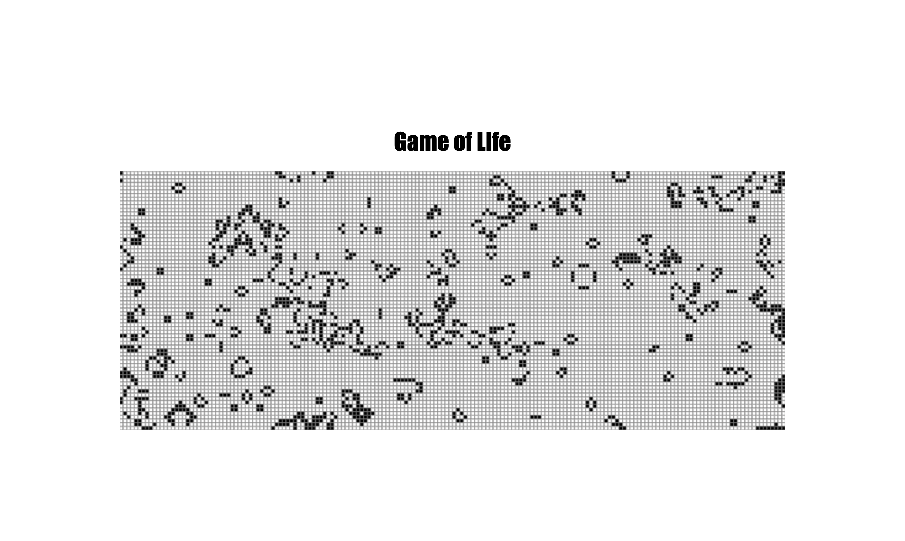

# Game of Life Simulation

This project is a simulation of Conway's Game of Life, a cellular automaton devised by mathematician John Conway. The simulation allows you to observe the evolution of a grid of cells based on simple rules.

## Table of Contents

1. [Getting Started](#getting-started)
2. [How to Play](#how-to-play)
3. [Customization](#customization)
   - [Generations.js](#generationsjs)
   - [Grid.js](#gridjs)
   - [GridDrawer.js](#griddrawerjs)
   - [Rules.js](#rulesjs)
   - [Food.js](#foodjs)
4. [Rules](#rules)
5. [Contributing](#contributing)
6. [License](#license)

## Getting Started

To run the simulation, open the `index.html` file in your web browser. This will render a grid on the canvas, and the cells will evolve according to predefined rules.

## How to Play

**Start the Simulation:**
The simulation starts automatically when you open the `index.html` file. You can observe the generations evolving on the grid.

## Customization

### Generations.js

**Purpose:**
The `Generations` class is responsible for managing the simulation of generations in Conway's Game of Life.

**Attributes:**
- `rows`, `columns`, `cellSize`: Dimensions and size of each cell in the grid.
- `numGenerations`: Number of generations to run in each iteration.
- `gridGenerator`: An instance of the `Grid` class responsible for generating the initial grid.
- `currentGrid`: Represents the current state of the grid.
- `gridDrawer`: An instance of the `GridDrawer` class responsible for rendering the grid on the canvas.

**Methods:**
- `runGenerations()`: Initiates the simulation loop, updating and rendering the grid for each generation.
- `sleep(ms)`: A utility function to introduce a delay between generations.
- `isGridEmpty(grid)`: Checks if all cells in the grid are empty.
- `isEveryoneAlive(grid)`: Checks if all cells in the grid are alive.

### Grid.js

**Purpose:**
The `Grid` class is responsible for generating the initial state of the grid.

**Attributes:**
- `rows` and `columns`: Dimensions of the grid.
- `grid`: Represents the 2D array that holds the state of each cell in the grid.

**Methods:**
- `generateRandomGrid()`: Generates a random initial state for the grid.
- `printGrid()`: Logs the current state of the grid to the console.

### GridDrawer.js

**Purpose:**
The `GridDrawer` class handles the rendering of the grid on the canvas.

**Attributes:**
- `rows`, `columns`, and `cellSize`: Dimensions and size of each cell in the grid.
- `canvas`: The HTML canvas element.
- `context`: The canvas rendering context.

**Methods:**
- `drawGrid(grid, foodLocations)`: Renders the grid on the canvas, considering the state of each cell and optional food locations.
- `getCellColor(cellValue)`: Determines the color of a cell based on its value.
- `drawFoodSquares(foodLocations)`: Draws food squares on the canvas.

### Rules.js

**Purpose:**
The `Rules` class contains the logic for applying the rules of Conway's Game of Life.

**Methods:**
- `applyRules(currentGrid, food)`: Applies the rules to determine the next state of each cell in the grid.
- `countLiveNeighbors(grid, row, col)`: Counts the number of live neighbors for a given cell.
- `getLastActiveTime(cellValue)`: Retrieves the last active time for a live cell.
- `isInactive(lastActiveTime, currentTime)`: Checks if a live cell is inactive for a specified period.

## Rules

The rules of Conway's Game of Life are as follows:

1. **Underpopulation:** Any live cell with fewer than two live neighbors dies.
2. **Survival:** Any live cell with two or three live neighbors survives.
3. **Overpopulation:** Any live cell with more than three live neighbors dies.
4. **Reproduction:** Any dead cell with exactly three live neighbors becomes a live cell.

Additionally, cells can become inactive if they remain unchanged for a specified period.
